# CNT-PatSight

> **From CNT literature to evidence-grounded experimental data.**  
> 将分散在碳纳米管论文中的催化剂、CVD 工艺与产物结果，转化为可追溯、可审核、可比较的实验级数据。

CNT-PatSight 是一个面向碳纳米管（CNT）研发的科研数据工程项目。它解决的不是“如何更快生成论文摘要”，而是一个更具体的问题：

> **如何从大量异构文献中，可靠地恢复每个实验运行的催化剂、反应过程、气体程序和产物结果，并保留这些数据与原文证据之间的联系？**

当前主线聚焦于 **CVD / CCVD 制备 CNT**，最终分析范围进一步限定为：

- 甲烷热 CVD；
- 粉体多壁碳纳米管（MWCNT）；
- Fe、Fe–Mo、Fe–Co 等 Fe 系催化剂；
- MgO、Al₂O₃ 等常见载体；
- 固定床与流化床实验；
- 温度、时间、分阶段气体流程、生长倍率、管径、BET 与产品质量。

[项目成果](#项目成果) · [数据管线](#数据管线) · [八表模型](#八表数据模型) · [质量评估](#质量评估与benchmark) · [工艺分析](#甲烷热cvd粉体mwcnt工艺分析) · [快速开始](#快速开始)

---

## 为什么需要这个项目

CNT 合成论文中的关键信息通常分散在实验部分、表格、图注、补充材料和表征结果中。同一篇论文还可能包含多个催化剂、温度条件和产品样品，因此“一篇论文一条记录”无法支持严谨比较。

实际数据还存在以下问题：

- “产率”“生长倍率”“生产率”“碳转化率”定义不同；
- 温度、压力、流量和保温时间分散在不同段落；
- 催化剂制备、活化和生长条件容易被错误合并；
- 一个表征结果可能只对应某个样品，而不是整篇论文；
- 文献未报告的字段不能用经验值或默认值补齐；
- 随机抽取结果必须经过证据校验，才能进入分析数据集。

CNT-PatSight 因此将工作拆分为三个层次：

1. **发现与筛选**：找到可能包含可用实验信息的文献；
2. **实验级抽取**：将一篇论文拆分为独立实验运行，并映射到统一 Schema；
3. **科学审核**：验证数值、单位、运行归属和原文证据，再决定数据是否可用于分析。

---

## 项目成果

以下数据为项目全量审计时的可复核快照。它们描述的是工程覆盖范围，不等同于全部数据都已成为金标准。

| 成果 | 规模或结果 |
|---|---:|
| 标准化文献来源 | **1,487** |
| 上游供应商来源记录 | **3,360** |
| 自动合并的重复候选 | **811** |
| 去重后唯一记录 | **675** |
| 仍需人工确认的去重决策 | **1** |
| 全文获取队列 | **1,064** |
| 下载并校验成功 | **504** |
| 来源级解析结果 | **509** |
| `good` / `partial` 解析 | **320 / 183** |
| 解析章节 | **约 16,461** |
| 解析全文字符 | **约 3,200 万** |
| 证据候选 | **47,836** |
| 自动测试 | **82 项通过** |
| 八表结构校验 | **0 errors，7 warnings** |

证据候选覆盖工艺、催化剂、表征、气体、规模与安全、产率和纯化等类别。其中工艺候选约 12,929 条、催化剂候选约 10,445 条、表征候选约 8,158 条。

### 当前数据状态

项目已经形成 A、B、C 三类结构化候选包：

| 层级 | 来源包数量 | 当前状态 |
|---|---:|---|
| A | 66 | `needs_review` |
| B | 139 | `needs_review` |
| C | 450 | `needs_review` |

这些结果应理解为：

> **可回查原文、可进入审核流程的候选数据资产。**

它们不是未经限制即可用于训练模型的金标准数据。C 类中的部分“运行”实际上是独立证据块或文献报告条件，不能直接按真实实验次数统计。

---

## 数据管线

```mermaid
flowchart LR
    A["OpenAlex / Semantic Scholar / Crossref / Unpaywall"] --> B["元数据标准化与原始响应归档"]
    B --> C["去重与 A/B/C/M/R 筛选"]
    C --> D["合法全文发现与获取"]
    D --> E["PDF / HTML 解析"]
    E --> F["章节、表格、图注与证据候选"]
    F --> G["运行规划与字段抽取"]
    G --> H["八表暂存"]
    H --> I["Schema、关系与证据校验"]
    I --> J["人工审核与问题记录"]
    J --> K["Gold / Silver / Candidate 数据"]
    K --> L["工艺对比与公司案例"]
```



### 1. 文献发现与筛选

- OpenAlex 作为主检索入口；
- Semantic Scholar 补充摘要、引用信息和开放全文链接；
- Crossref 补充 DOI、期刊、出版社和日期；
- Unpaywall 用于开放获取状态和合法全文发现；
- 保留逐请求原始响应、标准化记录和来源优先级；
- 使用保守规则进行相关性、可提取性和访问状态分层。

筛选 Benchmark 的已验证结果：

| 指标 | 结果 |
|---|---:|
| A 类精确率 | **95.74%** |
| 加权 A+B 目标召回率估计 | **90.56%** |
| R 类人工抽样误排除 | **0 / 25** |
| 去重人工审计 | **23 个决策，抽样未发现错误** |

这些指标只评价**元数据筛选和去重**，不代表全文实验字段的抽取准确率。

### 2. 全文获取与解析

全文获取流程会：

- 区分开放全文、落地页、付费墙和站点阻断；
- 检查 PDF / HTML 内容签名，而不是只相信 MIME；
- 限制文件大小并保存哈希；
- 避免不同内容覆盖同一文件；
- 保留获取状态、尝试记录和来源路径。

解析层使用规则方法处理：

- PDF 双栏文本；
- 页眉页脚；
- 标题和章节；
- 表格；
- 图注；
- 与催化剂、工艺、气体和产率相关的候选证据。

### 3. 实验运行级抽取

本项目不采用“一篇论文 = 一条记录”。

一个 `run_id` 应尽量对应：

```text
明确的催化剂体系
+ 明确的反应过程
+ 对应的产物或结果
= 一个独立实验运行
```

同一论文中的不同催化剂、温度、气体比例、反应时间或产品样品，应在证据允许时拆分为不同运行。无法可靠建立运行归属的内容保留为来源级证据，而不是强行生成完整实验。

---

## 八表数据模型

八表共包含 **183 个字段**。核心关系如下：

```text
source_master
  └─ source_run
       ├─ catalyst_system
       ├─ reactor_process_gas
       ├─ yield_quality
       └─ cost_scale_review

evidence_index / review_issue_log
  └─ 指向来源、运行或具体事实记录
```

| 表 | 作用 |
|---|---|
| `source_master` | 来源身份、标题、DOI、筛选结果和审核状态 |
| `source_run` | 一篇来源中的独立实验运行或证据单元 |
| `catalyst_system` | 金属、比例、载体、前驱体、制备、活化、粒径和 BET |
| `reactor_process_gas` | 反应器、工艺阶段、温度、时间、压力和气体流量 |
| `yield_quality` | 产率定义、转化率、CNT 类型、管径、Raman、TGA、纯度和后处理 |
| `cost_scale_review` | 规模、连续运行、催化剂寿命、成本、安全和工业复核 |
| `evidence_index` | 字段对应的原文证据、位置、状态和置信度 |
| `review_issue_log` | 冲突、缺失、错误严重度、解决状态和审核记录 |

权威定义：

- [`config/schema.json`](config/schema.json)
- [`config/field_dictionary.csv`](config/field_dictionary.csv)
- [`docs/field_definitions.md`](docs/field_definitions.md)
- [`docs/review_and_formalization.md`](docs/review_and_formalization.md)

### 数据原则

- 文献未报告的信息保持缺失；
- 原文值、标准化值、计算值和审核判断分开保存；
- 不将专利权利要求中的宽泛范围当作真实实验；
- 不强制统一定义不同的产率指标；
- 关键事实应尽量关联证据位置；
- 无法确定运行归属时，不伪造完整实验记录；
- 工程校验通过不等于科学事实已审核通过。

---

## 质量评估与 Benchmark

CNT-PatSight 将质量评估分为两类。

### 1. 筛选 Benchmark

用于评估文献发现、相关性分层和去重是否可靠。其结果见前文，不能替代实验字段抽取 Benchmark。

### 2. 实验字段抽取 Benchmark

最终 Benchmark 针对 20–30 篇人工精审论文和约 50–100 个明确实验运行，定量评估：

- `run_id` 识别；
- 催化剂组成、比例、载体和活化条件；
- 温度、时间、压力和分阶段气体流程；
- 生长倍率、产率、管径、BET 和质量表征；
- 数值与单位准确率；
- 缺失状态准确率；
- 跨表关联完整率；
- 证据覆盖率；
- 无依据补全率；
- 跨运行或跨样品污染率。

### 基线质量审计发现

早期 A 类人工审计中，121 个关键值有 113 个得到原文直接支持，直接支持率为 **93.4%**；将合理标准化和明确标注的图中估读计入后，支持率为 **98.3%**。同时发现 2 个无依据的常压值，以及 3 篇跨运行或跨样品归属问题。

B 类 10 篇审计中：

- 完全通过：0；
- 限定通过：4；
- 需要修正：5；
- 重大修正：1；
- 40 / 64 条工艺记录被补入原文未报告的常压；
- 3 篇存在跨运行或跨样品污染。

这些结果揭示了旧构造逻辑中的系统性风险：**默认值不能替代文献证据。**

项目据此采用以下修复策略：

- 禁止自动写入 `atmospheric`、`101.325 kPa`、`fresh catalyst` 等无证据默认值；
- 未报告字段统一保留为空或 `not_reported`；
- 推断值必须标记为 `inferred`，并与直接报告值隔离；
- 以 `evidence_index` 检查关键字段与原文的对应关系；
- 通过 `review_issue_log` 记录跨运行、跨样品和语义冲突；
- 建立 **Gold / Silver / Candidate** 三级发布体系。

| 等级 | 定义 | 用途 |
|---|---|---|
| Gold | 人工逐字段核验 | Benchmark、核心案例和回归测试 |
| Silver | 自动抽取后完成人工关键字段审核 | 跨文献工艺分析 |
| Candidate | 可追溯但尚未全面审核 | 检索、证据浏览和待审核队列 |

最终 Benchmark 报告应给出规则修复和人工审核前后的字段级指标，而不是只报告一个整体“准确率”。

---

## 甲烷热 CVD 粉体 MWCNT 工艺分析

跨文献分析只使用 Gold 和满足质量要求的 Silver 数据，避免将不同 CNT 路线和不可比指标混在一起。

### 分析边界

纳入：

- 甲烷热 CVD；
- 粉体 MWCNT；
- Fe、Fe–Mo、Fe–Co 等催化剂；
- MgO、Al₂O₃ 等载体；
- 固定床和流化床；
- 有明确实验运行和结果归属的数据。

不直接混入：

- PECVD；
- 基底上生长的 VACNT；
- SWCNT 阵列；
- 浮游催化剂连续纤维；
- 乙炔或乙醇 CVD；
- 只有宽泛工艺范围、没有实施结果的记录。

### 主要研究问题

- Fe、Fe–Mo、Fe–Co 体系常见于哪些生长窗口？
- MgO、Al₂O₃ 等载体与催化剂体系如何组合？
- 催化剂活化、温度和生长时间如何共同变化？
- CH₄、N₂、H₂ 在吹扫、还原、生长和冷却阶段如何切换？
- 生长倍率、管径和 BET 是否存在可观察的权衡？
- 哪些结果可跨论文比较，哪些受定义和设备差异限制？
- 哪些结论由多篇独立文献支持，哪些只来自单一研究团队？
- 哪些变量缺失最严重，形成了后续实验设计中的工艺空白？

### 预期输出

- 文献与实验运行筛选流程图；
- 字段缺失率矩阵；
- 催化剂–载体组合热图；
- 温度–生长时间工艺窗口图；
- 分阶段气体流程分类；
- 生长倍率、管径与 BET 的分布和权衡；
- 异常值、冲突文献和证据等级清单；
- 可验证的下一步研发问题。

分析结论使用范围、分位数、证据数量和适用边界表达，不将观察性文献数据包装成普适因果规律。

---

## 公司实验与文献对照

公司或实验室实验数据不进入公开仓库。内部案例通过同一八表 Schema 对实验报告进行映射，并回答：

- 公司实验条件位于公开文献工艺窗口的什么位置；
- 生长倍率、管径和 BET 在相似体系中处于什么范围或分位；
- 公司内部结论是否与跨文献观察一致；
- 实验记录缺少哪些关键变量；
- 下一轮应优先开展哪些控制变量实验。

对照分析重点关注：

- 设定温度与实际温度；
- 各阶段 CH₄ / N₂ / H₂ 流量；
- 反应压力；
- 催化剂投料量、粒径和 BET；
- 原料批次与重复实验；
- 生长倍率和产率定义；
- 管径统计方法；
- Raman、TGA 和 BET 测试条件。

该案例的定位是**研发决策支持和数据缺口诊断**，不宣称系统已经自动找出最优工业配方。

---

## 快速开始

### 环境

推荐 Python 3.11。

```bash
git clone <repository-url>
cd CNT-PatSight

python -m venv .venv
```

Windows PowerShell：

```powershell
.\.venv\Scripts\Activate.ps1
```

macOS / Linux：

```bash
source .venv/bin/activate
```

安装依赖：

```bash
python -m pip install --upgrade pip
python -m pip install -r requirements.txt
```

开发与测试依赖：

```bash
python -m pip install -r requirements-dev.txt
```

### 仓库自检

```bash
python scripts/production/pipeline.py doctor
```

### 运行测试

```bash
pytest -q
```

### 校验八表

```bash
python scripts/validation/validate_tables.py data/processed/eight_tables --combined
```

### 主要入口

| 功能 | 入口 |
|---|---|
| 元数据采集 | `scripts/collect_metadata/collect.py` |
| 全文获取 | `scripts/fetch_fulltext/fetch.py` |
| 全文解析 | `scripts/parse_fulltext/parse.py` |
| 提取与数据包 | `scripts/extraction/` |
| 生产控制 | `scripts/production/pipeline.py` |
| 八表校验 | `scripts/validation/validate_tables.py` |
| 筛选 Benchmark | `scripts/screening_benchmark/benchmark.py` |

API 凭据应写入由 [`.env.example`](.env.example) 创建的本地 `.env`。不要提交包含真实凭据的 `.env`。

---

## 仓库结构

```text
CNT-PatSight/
├── config/                    # Schema、词典、筛选和审核契约
├── data/
│   ├── raw/                   # 原始 API 响应、元数据、PDF、HTML
│   ├── interim/               # 解析结果、证据候选、提取包和审核队列
│   ├── processed/             # 八表、公开衍生数据和发布快照
│   ├── benchmark/             # Gold 样本、筛选与抽取 Benchmark
│   └── audit/                 # 质量审计和问题汇总
├── docs/                      # 项目边界、字段定义和发布政策
├── reports/                   # Benchmark、工艺分析和公开报告
├── scripts/
│   ├── collect_metadata/
│   ├── fetch_fulltext/
│   ├── parse_fulltext/
│   ├── extraction/
│   ├── production/
│   ├── validation/
│   └── reporting/
└── tests/                     # 单元测试、回归样本和仓库健康检查
```

`raw`、完整全文、运行缓存、SQLite 数据库和私有交付物可能受到版权或保密限制，不应默认进入公共发布。

---

## 公开边界与数据安全

公共仓库可以包含：

- 代码、测试和无密钥配置；
- Schema、字段定义和空白模板；
- Benchmark 指标和脱敏报告；
- 少量授权或可合法发布的样例；
- DOI、题目、开放获取链接和结构化衍生数据。

公共仓库不应包含：

- API 密钥、Token 和真实 `.env`；
- 公司实验、未公开配方或内部研发报告；
- 付费论文 PDF 或无再分发许可的全文；
- 大规模全文缓存和原始数据库；
- 未脱敏日志、人员、地点和实验编号；
- 本地绝对路径和临时运行文件。

公司数据与公开文献数据应从目录、版本控制和报告层面保持隔离。

---

## 项目边界

CNT-PatSight 的最终目标是完成以下闭环：

```text
文献发现
→ 实验级结构化
→ 抽取质量 Benchmark
→ 可信数据分级
→ 甲烷热 CVD–MWCNT 工艺对比
→ 公司实验与文献对照
```

本项目不以开发复杂网页、无限扩充文献数量或强行训练机器学习模型为成功标准。机器学习只有在目标定义统一、样本量和数据质量足够时才有意义，应作为独立后续研究，而不是用来掩盖数据问题。

---

## 局限性

- 全文获取受开放获取状态、付费墙和站点策略限制；
- 双栏 PDF、扫描件、复杂表格和图中数据仍可能需要视觉复核；
- 文献中产率、生产率和转化率定义不统一；
- 不同实验室、反应器和表征标准带来显著异质性；
- Candidate 数据不应直接作为模型训练标签；
- 专利适配器当前仍为预留设计，实际生产主线以论文为主；
- 工艺对比揭示的是跨文献观察和数据空白，不等价于受控实验因果结论。

---

## 适合谁

本项目可能对以下读者有参考价值：

- CNT、催化剂和 CVD 工艺研究人员；
- 材料信息学与科学机器学习研究者；
- 构建“文献到结构化数据”管线的工程人员；
- 研究证据约束信息抽取和人工审核流程的学生；
- 希望把公开文献与内部实验数据放在统一坐标系中比较的研发团队。

---

## 许可与第三方权利

在代码或数据许可证明确之前，请不要默认复制、再发布或商业使用本仓库内容。

论文、专利、补充材料和商标的权利归原权利人所有。本项目保存元数据、证据定位和结构化衍生物，并不因此获得原始全文的再分发权。

代码许可证和公开结构化数据许可证应分别管理。

---

## 致谢

CNT-PatSight 是一个独立完成的研究工程项目，形成于真实 CNT 研发环境中的文献整理与数据分析需求。项目的核心贡献不是“让 LLM 自动填表”，而是建立一套可追溯、可审核、能够暴露系统性错误并支持材料工艺分析的科研数据工作流。
