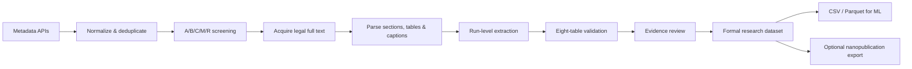

# CNT-PatSight

> **From carbon nanotube papers to evidence-grounded, ML-ready experimental data.**  
> Literature-first today, patent-ready by design.


CNT synthesis papers contain valuable catalyst, reactor, gas-program, yield, and product-quality data—but those facts are scattered across prose, tables, figures, and supplementary files, and their definitions are often inconsistent.

**CNT-PatSight turns that literature into structured experimental records without breaking the link to the original evidence.**

中文简介：CNT-PatSight 面向碳纳米管研发，将论文中的催化剂、反应条件、气体程序、产率和产品质量整理为可审核、可追溯、可用于机器学习的实验级数据。

[Quick Start](#quick-start) · [Benchmark](#benchmark-snapshot) · [Eight-Table Schema](#eight-table-data-model) · [Project Scope](docs/project_scope.md) · [Field Definitions](docs/field_definitions.md)

---

## Why this project exists

A normal literature search can tell you **which papers mention CNT synthesis**. It usually cannot reliably answer questions such as:

- Which Fe–Mo/MgO formulations were actually tested?
- What temperature, holding time, gas composition, and reactor stage produced each result?
- Does a reported “yield” mean mass gain, carbon yield, productivity, or conversion?
- Was the product SWCNT, DWCNT, or MWCNT, and how was that conclusion supported?
- Which values were explicitly reported, normalized, inferred, missing, or disputed?
- Can every database value be traced back to a page, section, table, figure, or quotation?

CNT-PatSight is designed around those questions.

### What makes it different

- **Run-level extraction** — one paper can contain many independent experimental runs.
- **Evidence-grounded records** — extracted facts remain linked to source evidence.
- **Explicit uncertainty** — missing, conflicting, approximate, and normalized values are not silently flattened.
- **Conservative screening** — relevance and extractability are evaluated separately.
- **Human-reviewable outputs** — the formal dataset is not a black-box LLM summary.
- **ML-ready architecture** — the reviewed eight-table database can be cleaned and exported to CSV or Parquet for modeling.

---

## Pipeline overview



The project separates three concerns that are often mixed together:

1. **Discovery:** find and prioritize relevant literature.
2. **Extraction:** convert experimental content into a stable schema.
3. **Formalization:** verify evidence, units, run boundaries, and unresolved issues before data becomes formal.

---

## Current status

CNT-PatSight is currently an **evidence-grounded research preview**.

Implemented:

- metadata collection and normalization;
- conservative deduplication;
- A/B/C/M/R relevance screening;
- full-text acquisition queues and integrity checks;
- section and candidate-experiment parsing;
- run-level eight-table extraction;
- schema, foreign-key, and evidence validation;
- review-state and formalization rules;
- public benchmark artifacts;
- optional nanopublication proof of concept.

In progress:

- larger full-text extraction benchmark;
- higher-quality table and figure parsing;
- broader manually reviewed sample set;
- stable ML export pipeline;
- patent-specific collection and claim handling.

---

## Benchmark snapshot

The frozen public screening benchmark is dated **2026-07-16**.

| Metric | Result |
|---|---:|
| Normalized metadata corpus | **1,487 records** |
| Stratified manual review | **120 / 120** |
| Tier-A precision | **95.74%** |
| Weighted Tier-A+B target recall estimate | **90.56%** |
| Tier-R false exclusions in reviewed sample | **0 / 25** |
| Deduplication audit | **23 decisions; no sampled errors found** |

Full machine-readable results: [`data/review/screening_benchmark/benchmark_metrics.json`](data/review/screening_benchmark/benchmark_metrics.json)

> **Important:** these numbers evaluate metadata screening and deduplication. They are not claims about end-to-end PDF parsing or experimental fact-extraction accuracy.

---

## Eight-table data model

The central design principle is simple:

> **A paper is a source; an experiment is a run; every important value should remain traceable.**

| Table | What it stores |
|---|---|
| `source_master` | Paper or patent identity, DOI, publication metadata, file state, and review state |
| `source_run` | Individual experimental runs and their extraction status |
| `catalyst_system` | Active metals, support, precursor, preparation, thermal treatment, composition, and structural properties |
| `reactor_process_gas` | Reactor type, stage sequence, temperature, pressure, time, and gas program |
| `yield_quality` | Original yield definition, normalized values, CNT type, morphology, Raman, TGA, diameter, and post-treatment |
| `cost_scale_review` | Demonstrated scale, continuous operation, catalyst lifetime, cost facts, and industrial-review fields |
| `evidence_index` | Source locator, quotation or evidence summary, confidence, target record, and value status |
| `review_issue_log` | Conflicts, missing critical facts, extraction warnings, and review decisions |

Authoritative schema:

- [`config/schema.json`](config/schema.json)
- [`config/field_dictionary.csv`](config/field_dictionary.csv)
- [`docs/field_definitions.md`](docs/field_definitions.md)

### Why not train directly from RDF or nanopublications?

The eight tables are the authoritative research database because they are easier to inspect, clean, join, and export.

Typical ML preparation:

```text
eight tables
→ join by run_id
→ normalize units
→ split mixed fields
→ encode categories
→ represent missingness
→ build X / y
→ export CSV or Parquet
```

Nanopublications are kept as an **optional provenance and publishing layer**, not as a replacement for the main database.

---

## Example research questions

Once enough reviewed runs are available, the dataset can support questions such as:

- How does Mo incorporation change CNT yield and diameter in Fe/MgO systems?
- Which catalyst-support combinations remain active at high methane-CVD temperatures?
- How do heating, growth, and cooling gas stages affect reproducibility?
- Which reported yield metrics are actually comparable?
- Which experimental conditions favor SWCNT, DWCNT, or MWCNT products?
- Which literature records contain enough quantitative data for regression, Bayesian optimization, or active learning?

The project does **not** assume that literature values are automatically comparable. Yield definitions, reactor scales, sampling methods, and characterization standards remain explicit.

---

## Quick start

### 1. Clone and install

Python **3.11+** is recommended.

```bash
git clone https://github.com/edwardwwwy/CNT-PatSight.git
cd CNT-PatSight

python -m venv .venv
```

Activate the environment:

```powershell
# Windows PowerShell
.\.venv\Scripts\Activate.ps1
```

```bash
# macOS / Linux
source .venv/bin/activate
```

Install dependencies:

```bash
python -m pip install --upgrade pip
python -m pip install -r requirements.txt
```

### 2. Run the clean-clone self-check

```bash
python scripts/production/pipeline.py doctor
```

This command checks the public repository without requiring local databases, credentials, or external downloads.

### 3. Validate an eight-table package

```bash
python scripts/validation/validate_tables.py data/interim/<source_id>
```

Browse the public examples and templates:

- [`data/samples/`](data/samples/)
- [`data/processed/templates/`](data/processed/templates/)

API credentials belong in a local `.env` copied from [`.env.example`](.env.example). Never commit a populated `.env`.

---

## Repository layout

```text
CNT-PatSight/
├── config/                     # Schemas, dictionaries, and extraction contracts
├── data/
│   ├── samples/                # Small licensed and sanitized examples
│   ├── processed/templates/    # Blank eight-table templates
│   └── review/                 # Public benchmark and audit artifacts
├── docs/                       # Scope, field definitions, policies, and architecture
├── reports/                    # Public reports and figures
├── scripts/
│   ├── collect_metadata/       # Metadata acquisition and normalization
│   ├── fulltext/               # Full-text acquisition and coverage
│   ├── extraction/             # Candidate and structured extraction
│   ├── validation/             # Schema and evidence validation
│   └── production/             # Queue, staging, recovery, and orchestration
└── tests/                      # Unit tests and public fixtures
```

Local runs may also create:

```text
data/raw/
data/interim/
data/derived/
output/
```

These directories can contain source caches, full texts, intermediate artifacts, complete databases, or private deliverables and are excluded from the default public release.

---

## Data quality and formalization

First-pass extraction is not automatically treated as final data.

A package becomes formal only after:

- the source and runs pass the required review state;
- all eight tables satisfy the schema and foreign-key rules;
- catalyst, process, yield, and cost/scale records have linked evidence;
- high-severity issues are resolved or represented without overstating the source;
- normalization and inference remain distinguishable from directly reported values;
- reviewer identity and review time are recorded where required.

See [`docs/review_and_formalization.md`](docs/review_and_formalization.md) for the full policy.

---

## Public release boundary

This repository is intended to publish the **pipeline, schema, benchmark, documentation, and small legal examples**—not an uncontrolled dump of source documents.

### Included by default

- source code, tests, and secret-free configuration;
- schemas, field definitions, and blank templates;
- benchmark metrics and public reports;
- a small number of licensed, sanitized, evidence-reviewed examples;
- DOI, title, open-access URL, and license metadata.

### Excluded by default

- API keys, passwords, tokens, and populated `.env` files;
- company experiments or unpublished R&D records;
- subscription-only or unauthorized paper PDFs;
- bulk full-text caches and raw API responses;
- complete private databases, SQLite files, and queue state;
- unsanitized logs or local paths containing personal information.

Open access does not always mean that a PDF may be redistributed. The default release stores metadata and structured derivatives rather than copies of source papers.

See [`docs/public_repository_policy.md`](docs/public_repository_policy.md).

---

## Roadmap

- [x] Metadata collection and normalization
- [x] Conservative screening and deduplication benchmark
- [x] Eight-table run-level schema
- [x] Evidence and review-state validation
- [x] Public repository boundary
- [ ] Thirty-paper end-to-end extraction benchmark
- [ ] Stronger table and figure extraction
- [ ] Reviewed multi-paper public sample release
- [ ] Reproducible ML baseline dataset
- [ ] Patent-specific acquisition and claim model
- [ ] Versioned public dataset release

---

## Who this is for

CNT-PatSight may be useful to:

- CNT and catalyst researchers;
- materials-informatics and scientific-ML researchers;
- engineers building literature-to-data pipelines;
- students studying evidence-grounded extraction;
- teams preparing traceable experimental datasets for optimization.

---

## Contributing

The project is still stabilizing its extraction and review contracts. Useful contributions include:

- parser fixes for scientific PDFs and tables;
- schema and validator tests;
- evidence-review examples;
- unit normalization rules;
- CNT terminology and ontology mappings;
- reproducible baseline models built from reviewed data.

Please open an issue before making a large schema change so that backward compatibility and evidence traceability can be discussed first.

---

## License and third-party rights

This repository currently does not include a project `LICENSE` file. Until a license is added, do not assume that the code or dataset may be reused or redistributed.

Rights to third-party papers, patents, supplementary materials, and trademarks remain with their respective owners. CNT-PatSight does not grant redistribution rights for those materials.

Before a wider release, the project should adopt separate licenses for:

1. **source code**, and
2. **published structured datasets**.

---

## Acknowledgment

CNT-PatSight is an independent research-engineering project focused on making CNT synthesis literature more structured, auditable, and useful for future machine learning.
