# CNT-PatSight: Evidence-Grounded Carbon Nanotube Literature & Patent Intelligence

> From CNT papers and patents to structured, traceable, and human-reviewable research data.

CNT-PatSight is a research data pipeline for carbon nanotube (CNT) R&D. It transforms papers, patents, and experimental records into structured, run-level datasets while preserving the evidence, uncertainty, and review status behind every catalyst, process condition, yield definition, and product-quality claim.

The project is currently a research preview. Automated outputs remain in `needs_review` or `pending_human_review`; they are never promoted automatically to `formal_extract` or `reviewed`.

[Data model](docs/field_definitions.md) · [Project scope](docs/project_scope.md) · [Repository structure](docs/repository_structure.md) · [Public release policy](docs/public_repository_policy.md)

## Key Capabilities

- Collect and normalize literature metadata from OpenAlex, Crossref, Semantic Scholar, and related sources.
- Apply conservative deduplication and A/B/C/M/R screening rules.
- Acquire legally accessible open full text and verify PDF, HTML, and file integrity.
- Parse sections, tables, captions, and candidate experimental passages.
- Extract catalyst systems, reactor conditions, gas programs, yields, and CNT quality at the individual run level.
- Validate the eight-table contract, foreign keys, evidence coverage, and review-state boundaries.
- Export review packages without hiding missing values, conflicting reports, or uncertainty.

## Workflow

```mermaid
flowchart LR
    A["API metadata"] --> B["Normalization and conservative deduplication"]
    B --> C["A / B / C / M / R screening"]
    C --> D["Legal open-full-text acquisition"]
    D --> E["PDF / HTML validation and parsing"]
    E --> F["Candidate experimental passages"]
    F --> G["Evidence-grounded run extraction"]
    G --> H["Schema and relationship validation"]
    H --> I["Eight-table staging"]
    I --> J["Human review"]
```



The production layer manages queues, leases, recovery, and transactional staging. It does not launch a local language model or bypass the human-review boundary.

## Benchmark Snapshot

The current public benchmark is based on the frozen results dated 2026-07-16. See [`benchmark_metrics.json`](data/review/screening_benchmark/benchmark_metrics.json) for the complete machine-readable output.

| Metric | Result |
|---|---:|
| Current metadata corpus | 1,487 records |
| Stratified human review | 120 / 120 |
| Tier-A precision | 95.74% |
| Weighted Tier-A+B target recall estimate | 90.56% |
| Tier-R false exclusions | 0 / 25 |
| Deduplication audit | 23 decisions; no sampled errors found |
| Stage gate | Passed; freeze rules and begin the 30-paper full-text pilot |

These figures evaluate metadata screening and deduplication, not end-to-end full-text parsing or fact-extraction accuracy. The rule-of-three 95% upper bound for the zero-error Tier-R sample remains 11.54%, so another 50–75 boundary cases are required before the rules can be considered stable.

## Eight-Table Data Contract

| Table | Responsibility |
|---|---|
| `source_master` | Unique paper or patent metadata, file state, and review state |
| `source_run` | Experimental-run identity, route, extraction state, and summary |
| `catalyst_system` | Catalyst composition, support, preparation, thermal treatment, and structural properties |
| `reactor_process_gas` | Stage-specific reactor conditions, temperature, pressure, and role-based gas programs |
| `yield_quality` | Original yield definition, CNT type, morphology, Raman, TGA, and post-treatment |
| `cost_scale_review` | Demonstrated scale, continuous operation, lifetime, cost facts, and human assessment fields |
| `evidence_index` | Source locations, target records, value status, confidence, and issue links |
| `review_issue_log` | Conflicts, critical gaps, quality warnings, and human-review decisions |

The authoritative machine-readable contract is defined in [`config/schema.json`](config/schema.json) and [`config/field_dictionary.csv`](config/field_dictionary.csv). See [`docs/field_definitions.md`](docs/field_definitions.md) for field semantics and relationships.

## Quick Start

Clone the repository and install the runtime dependencies:

```powershell
git clone https://github.com/edwardwwwy/CNT-PatSight.git
cd CNT-PatSight
python -m venv .venv
.\.venv\Scripts\Activate.ps1
python -m pip install --upgrade pip
python -m pip install -r requirements.txt
```

Run the smoke test, which does not download external content:

```powershell
python scripts/production/pipeline.py smoke-test
```

Development checks require `pytest` and `ruff`:

```powershell
python -m pip install pytest ruff
python -m pytest -q
ruff check scripts/collect_metadata scripts/fetch_fulltext scripts/parse_fulltext scripts/production scripts/extraction scripts/validation scripts/screening_benchmark tests
```

Validate an eight-table package:

```powershell
python scripts/validation/validate_tables.py data/interim/<source_id>
```

See [`scripts/production/README.md`](scripts/production/README.md) for production commands and data locations. Copy [`.env.example`](.env.example) to a local `.env` for API credentials, and never commit populated secrets.

## Repository Layout

```text
CNT-PatSight/
├── config/                     # Schemas, field dictionary, screening and extraction contracts
├── data/
│   ├── samples/                # Small, licensed, sanitized, human-reviewed examples
│   ├── processed/templates/    # Blank eight-table CSV and Excel templates
│   └── review/screening_benchmark/
│                               # Reproducible screening and deduplication benchmark
├── docs/                       # Scope, field definitions, structure, and release policy
├── reports/                    # Public metrics, figures, and reports
├── scripts/                    # Collection, full text, parsing, extraction, production, and validation
└── tests/                      # Unit tests and small public fixtures
```

Local runs also create `data/raw/`, `data/interim/`, `data/derived/`, and `output/`. These directories contain source caches, intermediate artifacts, or complete deliverables and are not part of the default GitHub release.

## GitHub Release Boundary

| Include by default | Exclude by default |
|---|---|
| Source code, tests, and secret-free configuration | `.env`, API keys, passwords, tokens, and private credentials |
| Eight-table schemas, field definitions, and blank templates | Company experiments, unpublished R&D records, and unsanitized logs |
| Benchmark metrics, audit tables, and public reports | Complete databases, SQLite files, queue state, and bulk intermediate output |
| One to three licensed, sanitized, human-reviewed examples | Papers obtained through subscriptions, institutional access, or unauthorized sources |
| DOI, title, OA URL, and license metadata | PDFs, supplements, or raw API responses without confirmed redistribution rights |

Open access does not automatically grant redistribution rights. Even when a source uses an open license, verify the exact terms and retain the title, authors, source, and license attribution. By default, this repository stores metadata and publishable structured derivatives rather than copies of source documents.

When the complete database is stable, publish it as a separately versioned dataset through GitHub Releases, Zenodo, or a dedicated dataset platform instead of adding it to normal Git history.

`.gitignore` only prevents untracked files from being added. Files already tracked by Git must be removed from the index and checked across repository history before publication. See [`docs/public_repository_policy.md`](docs/public_repository_policy.md) for the allowlist, review checklist, and safe migration guidance.

## Project Boundaries

- The main focus is CVD and CCVD CNT synthesis, especially catalysts, gas programs, process conditions, and experimental outcomes.
- Patent collection adapters are currently reserved for later use; broad claims must not be treated as demonstrated experiments.
- Yield values with different definitions are not treated as directly comparable.
- Author-claimed scale is kept separate from experimentally demonstrated scale.
- Missing and uncertain information remains explicit and is never guessed by the extraction layer.
- First-pass automated output requires human confirmation before entering the formal data layer.

## License and Third-Party Rights

This repository does not currently include a `LICENSE` file, so its code and data must not be assumed to be open-source licensed. Rights to third-party papers, patents, supplementary materials, and trademarks remain with their respective owners. CNT-PatSight does not grant redistribution rights for those materials.

Before public release, the repository owner should select separate, appropriate licenses for the project code and the published dataset.
