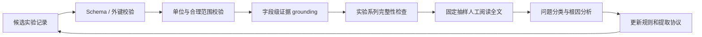
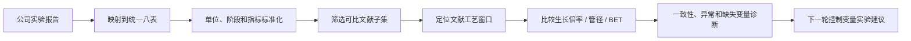
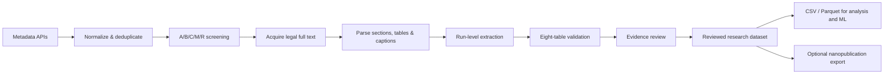

# CNT-PatSight

> **从碳纳米管文献到可追溯、可比较、可用于研发决策的实验级数据。**<br>
> From CNT literature to evidence-grounded, run-level experimental intelligence.


CNT-PatSight 是一个面向碳纳米管研发的数据工程与分析项目。它将论文中分散在正文、表格、图片和补充材料里的催化剂、反应器、气体程序、工艺条件和产品结果，整理成**实验运行级八表数据**，并始终保留字段到原始证据的回查链路。

本项目集中展示我在实习期间完成的四类工作：

1. 建设 CNT 文献发现、筛选、全文解析和实验级结构化管线；
2. 建立抽取质量 Benchmark，对实验记录、工艺参数和结果字段做定量评估；
3. 针对甲烷热 CVD 粉体 MWCNT 子集开展跨文献工艺流程对比；
4. 将公司实验报告映射到统一八表，并与文献工艺窗口进行对照分析。

[项目成果](#项目成果一览) · [质量 Benchmark](#抽取质量-benchmark) · [工艺对比](#甲烷热-cvd-粉体-mwcnt-工艺对比) · [公司案例](#公司实验与文献对照案例) · [八表模型](#八表数据模型) · [快速开始](#快速开始)

---

## 项目成果一览

| 成果 | 当前规模 | 访客可以看到什么 |
|---|---:|---|
| 文献数据底座 | **1,487** 条标准化元数据 | 来源归一化、保守去重、A/B/C/M/R 分层筛选 |
| 全文结构化 | **509** 篇来源级解析结果 | 章节、表格、图注、段落和稳定证据定位 |
| 证据候选库 | **47,836** 条候选证据 | 催化剂、工艺、气体、产率、表征、纯化和规模安全信息 |
| 实验级数据 | A 类 **66** 篇、B 类 **139** 篇、C 类 **450** 篇提取包 | 来源、run、催化剂、工艺、结果和审核问题之间的关联 |
| 数据契约 | **8 张表、183 个字段** | 统一字段、单位、缺失状态、证据状态和外键关系 |
| 质量验证 | 筛选 Benchmark + A/B 实验字段人工审计 | 不只报告“抽了多少”，也量化“哪些值可信、哪些值需要修正” |

> **当前定位：** 这是一个 evidence-grounded research preview。现有结果适合作为带原文回查能力的候选数据和分析基础；未经正式审核的记录不应直接视为金标准或模型训练标签。

## 为什么要做这个项目

普通文献检索可以回答“哪些论文提到了 CNT 合成”，但很难直接回答研发人员真正关心的问题：

- Fe、Fe–Mo、Fe–Co 催化剂分别在什么载体和温度窗口下工作？
- 同一篇论文中的多组实验是否被正确拆成独立运行？
- 升温、还原、生长和冷却阶段各自使用了什么气体程序？
- 文献中的“产率”究竟表示生长倍率、碳产率、质量增益、生产率还是转化率？
- MWCNT 的管径、BET、Raman 或 TGA 结果究竟属于哪个样品和哪个 run？
- 一个数据库值是作者直接报告、单位标准化、图中估读、项目推断，还是根本没有报告？
- 公司实验处于文献工艺窗口的中心、边界还是空白区域？

CNT-PatSight 的目标不是把论文压缩成摘要，而是把这些问题转化为**可查询、可比较、可审核的实验记录**。

## 我在实习期间完成的工作

### 1. 文献到实验数据的完整链路

建立了从元数据 API 到八表数据的端到端流程，包括：

- OpenAlex、Semantic Scholar、Crossref 和 Unpaywall 元数据采集；
- DOI、标题、年份、作者和期刊联合去重；
- A/B/C/M/R 文献优先级筛选；
- 合法开放全文发现、下载、哈希校验和缓存；
- PDF/HTML 章节、表格、图注和证据段落解析；
- 论文级来源向实验级 run 的拆分；
- 八表映射、外键校验、字段证据校验和问题日志生成。

### 2. 抽取质量 Benchmark

对质量的评估从“整篇论文是否相关”深入到实验字段层面，定量检查：

- 实验系列是否完整，成功与失败 run 是否都被保留；
- 催化剂、温度、时间、压力和气体流量是否与原文一致；
- 生长倍率、管径、BET、Raman、TGA 等结果是否绑定到正确样品；
- 原始单位、换算值、近似符号和结果定义是否被保留；
- 每个关键字段能否定位到实际页面、表格、图片或正文段落；
- `reported`、`normalized`、`calculated`、`inferred` 和 `not_reported` 是否被正确区分。

### 3. 甲烷热 CVD 粉体 MWCNT 工艺对比

将分析范围限定到可比性更高的“甲烷 + 热 CVD + 粉体 MWCNT”子集，避免把等离子体 CVD、浮游催化剂、阵列 CNT 和不同产率定义直接混在一起。

在同一分析框架下比较：

- Fe、Fe–Mo、Fe–Co 等催化体系；
- MgO、Al₂O₃ 等载体；
- 温度、生长时间、还原/惰性/碳源气体流程；
- 生长倍率、CNT 管径和 BET；
- 文献冲突、异常值、实验系列缺项和关键工艺空白。

### 4. 公司实验与文献对照

将公司实验报告映射到与文献完全相同的八表契约，再进行同口径比较，以回答：

- 公司条件位于已报道文献工艺窗口的什么位置；
- 公司生长倍率、管径和 BET 在同类数据中处于什么水平；
- 公司结论是否与跨文献趋势一致；
- 当前实验记录缺少哪些影响复现和解释的关键变量；
- 下一轮应优先安排哪些控制变量实验。

公司原始实验和未公开研发信息不进入公共仓库；公开部分只保留可复用的方法、数据模型和脱敏后的流程说明。

---

## 抽取质量 Benchmark

项目将 Benchmark 分成两个层次。第一层评估“文献有没有筛对”，第二层评估“实验事实有没有抽对”。两者不能用同一个准确率代替。

### 1. 文献筛选与去重 Benchmark

冻结版本日期为 **2026-07-16**。

| 指标 | 结果 |
|---|---:|
| 标准化元数据语料 | **1,487 条** |
| 分层人工复核 | **120 / 120** |
| Tier-A precision | **95.74%** |
| 加权 Tier-A+B 目标召回率估计 | **90.56%** |
| 复核样本中的 Tier-R 错误排除 | **0 / 25** |
| 去重审计 | **23 个决策，抽样未发现错误** |

机器可读结果：[benchmark_metrics.json](data/benchmark/results/screening_benchmark/benchmark_metrics.json)

这些指标只评价元数据筛选和去重，不代表 PDF 解析或实验字段抽取准确率。

### 2. 实验级记录与字段抽取 Benchmark

#### A 类随机人工复核

从 66 篇已提取论文中固定随机抽取 10 篇、20 个 run：

| 指标 | 结果 |
|---|---:|
| 检查关键值 | **121** |
| 原文直接支持 | **113 / 121，93.4%** |
| 加入明确限定的标准化/图中估读值后 | **119 / 121，98.3%** |
| 类别级检查点 | **160** |
| 严格通过 / 部分通过 / 失败 | **117 / 24 / 19** |
| 完全无原文依据的值 | **2**，均为未报告压力被填成常压 |

完整报告：[八表数据随机 10 篇人工复核报告](reports/manual_quality_audit_10_20260717.md)

#### B 类随机人工复核

从当时已进入八表交付的 93 篇 B 类论文中固定哈希抽取 10 篇，阅读全文并检查 59 个成果 run、64 条工艺记录和 270 条证据：

| 判定 | 论文数 |
|---|---:|
| 完全通过 | **0** |
| 限定通过 | **4** |
| 需要修正 | **5** |
| 重大修正 | **1** |

主要系统性问题包括：

- 6/10 篇论文、40/64 条工艺记录被补入原文未报告的 `atmospheric / 101.325 kPa`；
- 表征字段跨 run 或跨样品继承；
- 图中近似值被包装为不带限定的精确值；
- 同一名义条件的冲突结果被静默合并；
- 实验系列成员漏项，或失败 run 继承成功样品的产品结论；
- 成本、安全和规模判断被误标为作者直接报告。

完整报告：[B 类数据随机抽样质量审计](reports/b_class_quality_audit_10_20260720.md)

这组结果的价值在于暴露问题，而不是制造一个过度乐观的综合准确率。审计结论直接推动了新版 B 类重做规则：禁止无来源默认压力、默认实验规模和默认催化剂状态，并要求字段级证据与 campaign 完整性对账。

### 3. 质量提升闭环



自动规则负责发现结构错误、非法单位、孤立外键和明显异常；人工审核负责判断 run 边界、样品归属、图表语义和论文上下文。二者共同决定一条记录能否从 `needs_review` 升级为正式数据。

---

## 甲烷热 CVD 粉体 MWCNT 工艺对比

### 为什么先限定一个子集

CNT 文献的“产率”和“质量”高度依赖反应器、碳源、产品形态和测量定义。如果直接混合所有路线，容易得到没有物理意义的相关性。因此本项目首先限定：

```text
carbon source = methane
synthesis route = thermal CVD
product form = powder
CNT family = MWCNT
```

然后再在子集内做催化剂、载体、工艺和结果比较。

### 分析维度

| 维度 | 对比内容 | 质量控制 |
|---|---|---|
| 催化剂 | Fe、Fe–Mo、Fe–Co，金属比例和负载量 | 区分活性金属、助剂、前驱体和最终催化剂状态 |
| 载体 | MgO、Al₂O₃ 及复合载体 | 不把载体、基底和反应器填料混为一类 |
| 温度与时间 | 还原温度、生长温度、保温时间、阶段顺序 | 保留原始值、标准化值和近似状态 |
| 气体流程 | 惰性气、还原气、甲烷流量、总流量和阶段切换 | 不用单一“气氛”字段覆盖多阶段程序 |
| 生长表现 | 生长倍率、质量产率、生产率或转化率 | 按 `metric + definition + unit + basis` 分组后再比较 |
| 产品质量 | 管径、BET、Raman、TGA、纯度和形貌 | 只有样品/run 关联明确时才进入运行级比较 |
| 数据异常 | 冲突值、异常值、缺失工艺和实验系列漏项 | 保留冲突，不静默选择看起来更合理的值 |

### 可形成的分析输出

- 催化剂—载体组合与可用温度窗口矩阵；
- 还原、生长和冷却阶段的典型气体流程；
- 生长倍率、管径和 BET 的同口径分布；
- 高结果区域与关键缺失变量的联合视图；
- 同一论文内和跨论文冲突清单；
- 文献覆盖密集区、边界区和工艺空白区。

这里的目标不是给出一个脱离定义的“最佳配方”，而是建立可解释的比较边界，并指出哪些结论有足够证据、哪些只能作为下一轮实验假设。

---

## 公司实验与文献对照案例

### 分析流程



### 具体回答的问题

1. **工艺位置**：公司温度、时间、甲烷流量、催化剂和载体处于文献分布的中心、边缘还是尚未充分探索的区域。
2. **结果水平**：在产率定义和测试方法可比的前提下，判断生长倍率、管径和 BET 所处区间。
3. **规律一致性**：检查公司观察到的温度效应、金属协同或气体效应是否与跨文献趋势相符。
4. **记录完整性**：识别压力、反应器尺寸、催化剂实际质量、总流量、停留时间、还原程序、重复次数和表征采样位置等缺失变量。
5. **下一轮实验设计**：把文献密集窗口用作基线，把冲突区和空白区转化为控制变量实验。

### 建议的下一轮实验框架

- 固定催化剂批次、装料量和反应器结构，做温度 × 甲烷流量的小型因子设计；
- 明确记录总流量、各阶段持续时间、压力和升降温过程；
- 同时保存原始质量、催化剂质量和生长倍率计算依据；
- 设置重复实验和必要的空白/对照组，避免把批次波动解释成工艺趋势；
- 统一 BET、TEM 管径统计和取样位置，使公司结果能够与文献同口径比较；
- 优先验证“公司结果与文献趋势冲突”或“文献覆盖稀疏但业务价值高”的条件。

该案例展示的是一种从文献数据走向实验决策支持的方法：既判断“结果好不好”，也判断“这个比较是否成立、还缺什么信息、下一步怎样验证”。

---

## 系统流程



系统将三个容易混在一起的阶段明确分开：

1. **Discovery**：发现、去重并按相关性和可提取性排列文献；
2. **Extraction**：将论文中的实验内容映射到稳定数据契约；
3. **Formalization**：复核证据、单位、run 边界和未解决问题后才允许正式化。

## 八表数据模型

核心原则是：

> **论文是来源，实验是 run，关键字段必须能够回到证据。**

| 表 | 内容 |
|---|---|
| `source_master` | 论文或专利身份、DOI、出版信息、文件状态和审核状态 |
| `source_run` | 独立实验运行、证据单元和提取状态 |
| `catalyst_system` | 活性金属、载体、前驱体、制备、热处理、组成和结构性质 |
| `reactor_process_gas` | 反应器、工艺阶段、温度、压力、时间和气体程序 |
| `yield_quality` | 原始产率定义、标准化结果、CNT 类型、形貌、Raman、TGA、管径和后处理 |
| `cost_scale_review` | 已展示规模、连续运行、催化剂寿命、成本事实、安全和工业化复核 |
| `evidence_index` | 原文定位、证据文本、置信度、目标记录和事实状态 |
| `review_issue_log` | 冲突、关键缺失、抽取警告、严重度和审核决定 |

权威定义：

- [config/schema.json](config/schema.json)
- [config/field_dictionary.csv](config/field_dictionary.csv)
- [docs/field_definitions.md](docs/field_definitions.md)

典型分析和机器学习准备流程：

```text
eight tables
→ 按 run_id 关联
→ 限定可比实验子集
→ 统一单位但保留原始值
→ 区分 reported / normalized / inferred
→ 显式编码缺失与冲突
→ 构建统计分析或 X / y 数据集
```

Nanopublication 只作为可选的溯源与发布层，八表仍是主要研究数据库。

## 数据可靠性设计

首轮抽取不会自动成为正式数据。一份提取包只有在满足以下条件后才能正式化：

- 来源和 run 达到规定的审核状态；
- 八张表通过 schema、唯一键和外键校验；
- 催化剂、工艺、结果和成本/规模记录具有对应证据；
- 高严重度问题已经解决，或以不夸大原文的形式表示；
- 直接报告、单位标准化、计算、推断和缺失保持可区分；
- 需要时记录审核人、审核时间和处理结论。

完整政策：[review_and_formalization.md](docs/review_and_formalization.md)

## 当前状态

已实现：

- 元数据采集、归一化与原始响应归档；
- 保守去重和 A/B/C/M/R 筛选；
- 全文获取队列、合法来源判断和完整性检查；
- PDF/HTML 章节、表格、图注与候选实验证据解析；
- 实验运行级八表提取；
- schema、外键、字段证据和审核状态校验；
- 筛选 Benchmark 与实验字段人工质量审计；
- 甲烷热 CVD 粉体 MWCNT 对比分析框架；
- 公司实验八表映射和文献对照分析方法；
- 可选 Nanopublication 概念验证。

仍在推进：

- 扩大实验字段抽取 Benchmark；
- 完成新版 B 类严格重做；
- 改进复杂表格和图片解析；
- 构建只包含审核通过字段的稳定分析/ML 视图；
- 发布更大规模、可合法再分发的公共样本；
- 实现专利采集和权利要求专用模型。

## 快速开始

推荐使用 Python **3.11+**。

```bash
git clone https://github.com/edwardwwwy/CNT-PatSight.git
cd CNT-PatSight

python -m venv .venv
```

激活环境：

```powershell
# Windows PowerShell
.\.venv\Scripts\Activate.ps1
```

```bash
# macOS / Linux
source .venv/bin/activate
```

安装依赖：

```bash
python -m pip install --upgrade pip
python -m pip install -r requirements.txt
```

运行公开仓库自检：

```bash
python scripts/production/pipeline.py doctor
```

验证一个八表样本：

```bash
python scripts/validation/validate_tables.py data/benchmark/fixtures/six_papers/<source_id>
```

查看公开样本与模板：

- [data/benchmark/fixtures/public/](data/benchmark/fixtures/public/)
- [data/benchmark/fixtures/six_papers/](data/benchmark/fixtures/six_papers/)
- [data/benchmark/templates/](data/benchmark/templates/)

API 凭证应写入从 [.env.example](.env.example) 复制的本地 `.env`，不要提交真实凭证。

## 仓库结构

```text
CNT-PatSight/
├── config/                       # Schema、字段字典、筛选与提取契约
├── data/
│   ├── raw/                      # 原始 API 响应、元数据和合法来源文件
│   ├── interim/                  # 解析文本、证据候选和 A/B/C 提取包
│   ├── processed/eight_tables/   # 八表正式输出位置
│   ├── benchmark/                # Gold、fixtures、模板和 Benchmark 结果
│   └── audit/                    # 抽样、问题和质量/迁移审计
├── docs/                         # 范围、字段、审核和公开边界
├── reports/                      # 可公开的质量报告和演示
├── scripts/
│   ├── collect_metadata/         # 元数据采集、归一化和去重
│   ├── fetch_fulltext/           # 合法全文发现与下载
│   ├── parse_fulltext/           # PDF/HTML 解析与证据候选
│   ├── extraction/               # 运行规划和八表抽取
│   ├── validation/               # Schema、证据和质量校验
│   ├── screening_benchmark/      # 筛选与去重 Benchmark
│   └── production/               # 队列、暂存、恢复和编排
└── tests/                        # 单元测试和回归测试
```

## 公开发布边界

公共仓库用于发布**代码、Schema、Benchmark、文档和少量合法样本**，不用于倾倒来源文件或公司数据。

默认可以公开：

- 源代码、测试和不含秘密的配置；
- Schema、字段定义和空白模板；
- Benchmark 指标、审计方法和公共报告；
- 少量经过许可、脱敏和证据审核的样本；
- DOI、标题、开放获取 URL 和许可证元数据。

默认不得公开：

- API key、密码、令牌和真实 `.env`；
- 公司实验、未公开研发数据和内部人员信息；
- 订阅论文或无权再分发的 PDF；
- 批量全文缓存、完整私有数据库和队列状态；
- 未脱敏日志和包含个人路径的信息。

公司数据通过仓库外路径接入，例如：

```text
CNT_COMPANY_DATA_DIR=E:\github\CNT-PatSight-private\company
```

详见 [public_repository_policy.md](docs/public_repository_policy.md)。

## 项目价值

CNT-PatSight 适合以下访客了解或继续使用：

- CNT、催化剂和 CVD 工艺研究人员；
- 材料信息学与科学机器学习研究者；
- 需要把论文证据转成结构化数据的工程团队；
- 希望对照内部实验和公开文献的研发团队；
- 学习证据约束抽取、数据审核和实验设计的学生。

这个项目的核心价值不只是“从论文里抽字段”，而是建立一条从**文献证据 → 可比较实验 → 质量审计 → 工艺洞察 → 下一轮实验决策**的可追溯链路。

## Roadmap

- [x] 元数据采集、归一化和保守去重
- [x] A/B/C/M/R 筛选及公开 Benchmark
- [x] 实验运行级八表 Schema
- [x] 证据、审核状态和正式化校验
- [x] A/B 类实验字段抽取质量审计
- [x] 甲烷热 CVD 粉体 MWCNT 对比框架
- [x] 公司实验八表映射和文献对照案例
- [ ] 扩大端到端实验字段 Benchmark
- [ ] 完成 B 类 source-first 严格重做
- [ ] 发布审核通过的多论文公共样本
- [ ] 构建可复现的 ML baseline 数据集
- [ ] 实现专利专用采集与 claim 模型
- [ ] 发布版本化公共数据集

## License 与第三方权利

仓库目前没有项目 `LICENSE` 文件。在许可证正式加入前，不应默认代码或数据可以再使用或再分发。

第三方论文、专利、补充材料和商标的权利归各自所有者。CNT-PatSight 不授予这些材料的再分发权。未来公开发布时，应分别为源代码和结构化数据选择适当许可证。

---

**CNT-PatSight：让 CNT 合成文献从“可以搜索”进一步变成“可以审核、比较和用于实验决策”。**
